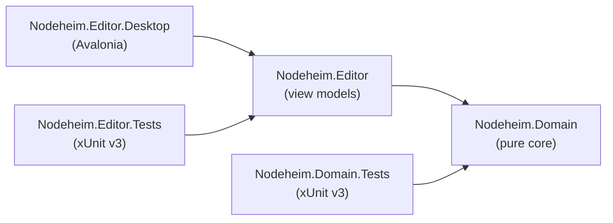

# Nodeheim

A pure, platform-agnostic graph engine in C# / .NET — a network of **nodes** that **agents** traverse, wrapped by interchangeable frontends and persistence adapters.


## Overview

Nodeheim is an **engine**, not an application. Its heart is a clean domain core: a graph of nodes, where each node holds references to its neighbors, traversed by agents that move across it. The core knows nothing about the outside world — user interfaces, databases, and file formats are attached as interchangeable adapters (hexagonal architecture / ports & adapters).

Because the core is domain-agnostic, a logistics simulation, a game world, or a story-driven engine are all just applications built on the same foundation.

> Nodeheim is the successor to *LogSim*, an earlier project, rebuilt from the ground up around platform purity and swappable frontends.

## Architecture

Every dependency points inward. The domain core references nothing; every other project depends on it, never the reverse — a boundary the compiler enforces physically.



Guiding principles:

- **Hexagonal (ports & adapters)** — the domain is a pure core; UI and persistence live in outer adapters.
- **Composition over inheritance** — capabilities are attached via interfaces and composition, not base-class hierarchies.
- **References inside, IDs at the boundaries** — the live in-memory graph uses direct object references; IDs appear only when crossing a boundary (persistence, or an agent's inner map).
- **Topology ≠ position** — the core is pure topology (nodes and neighbors); geometry is an optional, attached aspect.

## Project structure

```
Nodeheim/
├── src/
│   ├── Nodeheim.Domain/          # pure domain core — references nothing
│   ├── Nodeheim.Editor/          # framework-free view models → Domain
│   └── Nodeheim.Editor.Desktop/  # Avalonia frontend → Editor
└── tests/
    ├── Nodeheim.Domain.Tests/    # xUnit v3 → Domain
    └── Nodeheim.Editor.Tests/    # xUnit v3 → Editor
```

## Getting started

Prerequisites: the [.NET 10 SDK](https://dotnet.microsoft.com/download).

```bash
# clone
git clone https://github.com/tiancama/Nodeheim.git
cd Nodeheim

# build the solution
dotnet build

# run the editor
dotnet run --project src/Nodeheim.Editor.Desktop

# run the tests
dotnet test
```

## Using the editor

| Action | Input |
|---|---|
| Create a node | Double-click on the canvas |
| Select a node or connection | Click |
| Add to or remove from selection | Ctrl+Click |
| Clear selection | Click on empty canvas |
| Move selection | Drag |
| Connect selected nodes | `C` |
| Disconnect selected nodes | `D` |
| Delete selected nodes | `Delete` |

Clicking a connection selects both of its endpoints; dragging it moves both.

## Tech stack

- **Language / runtime:** C# 14 on .NET 10 (LTS)
- **UI:** Avalonia (MVVM), cross-platform
- **Tests:** xUnit v3
- **Persistence** *(planned)*: SQLite first, then PostgreSQL; JSON and XML as export/import formats

## Status

Early development. The domain core (nodes, neighbors, and the `Graph` manager) and an Avalonia editor exist and are covered by tests. The editor supports creating, selecting, moving, connecting, disconnecting, and deleting nodes. Persistence is the next milestone, followed by agent movement. The API is expected to change.

This is primarily a personal learning project; issues and feedback are welcome.

## License

Nodeheim is released under the MIT License. See [`LICENSE`](LICENSE) for details.
